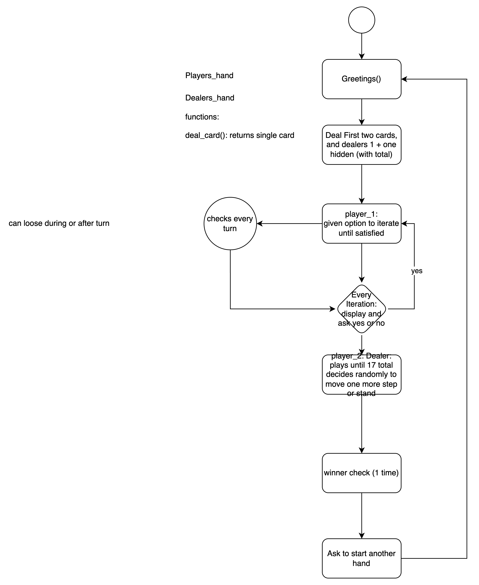

**GAME OF BLACK JACK**

### Assumptions:
    - Ace will be treated as 11 and won't change it's value even when user crosses 21 (rule in some of the casinos)
    - unlike physical settings, this game can deal same card more than once

### Flow Chart:

[source image](https://app.diagrams.net/#G11jGeQnyOuR-fk1FHH93nrXPWfAO7l1Kn#%7B%22pageId%22%3A%22C5RBs43oDa-KdzZeNtuy%22%7D)
