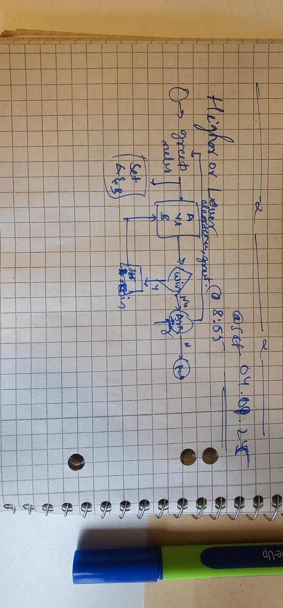

## Flow chart:


## Pseudocode
```python
from game_data import data


def greetings()
- print logo
- print rules

def select_random_name() -> dict:
    return random.choice()

def play_round(a:dict) -> return list: 
    if a:
        set a = a.copy()
    else:
     a = select_random_name()

    b = select_random_name()
    
    display A and B
        Compare A: Lionel Messi, a Footballer, from Argentina.
        use vs logo
        Against B: Kourtney Kardashian, a Reality TV personality, from United States.
    
    ask user choice = input("Who has more followers? Type 'A' or 'B': ")
    check winner 
        if a.follower <= b.follower
    return round_winner, result


def play():
    score = 0
    is_game = True
    a = None

    while is_game:
        round_winner, result = play_round(a:dict)
        if not result:
            You loose, and your final score is {score}
            return
        else:
            update score
            a = round_winner

if __name__ = "__main__":
    while input("Do you want to play? y/n").lower() == "y":
        os.system("clear")
        play()
    print("Thanks for playing")
```


