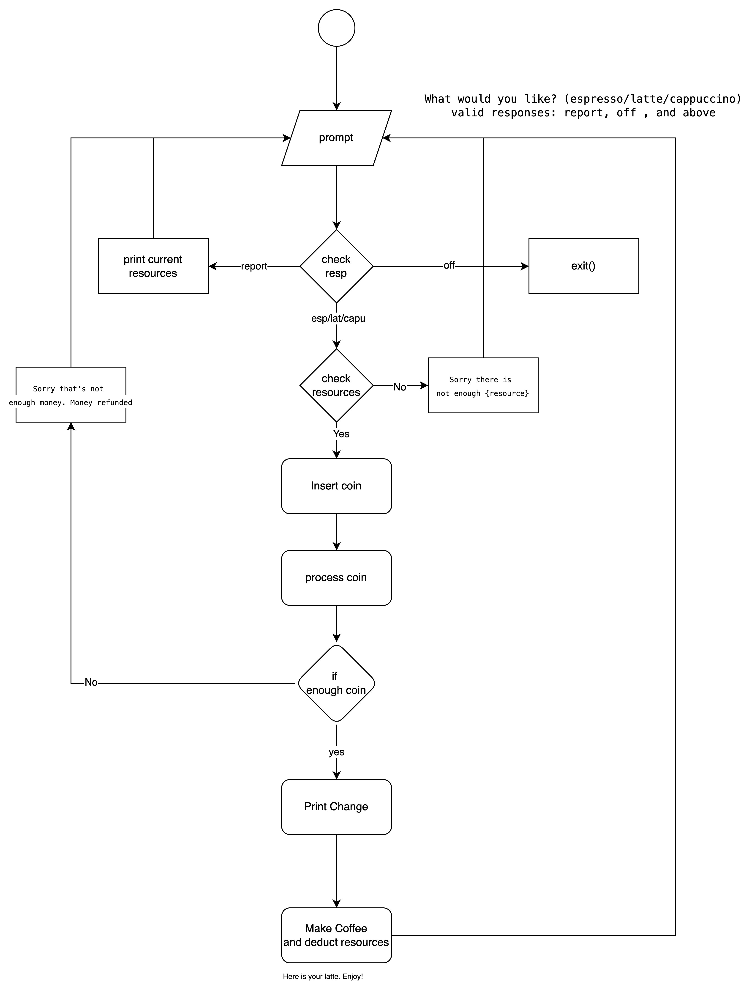
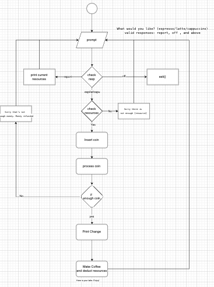

# Coffee Machine 

## Understanding Problem:

What are we trying to do:
> Trying to build functionality of a coffee machine into code

## Flow Chart

[source](https://app.diagrams.net/#G1M5slY3c8EI-nLHnV5YC18qiMZ7v_W58Y#%7B%22pageId%22%3A%22C5RBs43oDa-KdzZeNtuy%22%7D)

<!--  -->

## Pseudo Code

What do we want to do to solve the problem

# TODO: 1. Ask what the user wants to do

if user selects == drink , process # TODO: x
if user selects == off, terminate process
if user selects == report, print report and ask prompt #TODO: 1 again

# TODO: 2. MAKE COFFEE

# TODO: 1. Print report of all coffee resources
# TODO: 2. Insert coin and process them
# TODO: 3. Check resources
# TODO: 4. Ask for user prompt
# TODO: 5. Make coffee and deduct coffee resources
# TODO: 6. Declare coffee resources
# TODO: 7. Declare drink options

