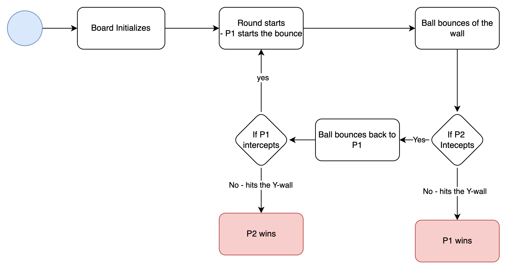

# creating a ping pong game
Allows two players to play a ping pong game, and declares winner

CJM:
start -> both players play the game* -> if one player misses the pong, the other player wins

both players play the game*:
ball starts from left players position -> goes in 45(random) deg angle up, or down -> bounces of the X-wall by 90 deg -> ball goes towards Y-wall 
if :
-> player intercepts the ball, ball bounces towards x-wall with an angle of 90 or 135 degrees (to check) -> until it reaches other side y-wall

else -> player misses the ball -> ball ycors matches y-wall coordinates -> declares other player the winner

bounce function: opp direction default, and angle

--------------------------------
### Use Case #1

1. **Game Start**  
   - Both players begin playing the game.  
   - The game proceeds until one player fails to intercept the ball, resulting in the other player's victory.  

2. **Gameplay Mechanics**  
   - The ball starts from the left player's position.  
   - It moves at a random 45-degree angle, either upwards or downwards.  
   - The ball bounces off the X-wall at a 90-degree angle and travels toward the Y-wall.  

3. **Player Interaction**  
   - **If the player intercepts the ball**:  
     - The ball bounces back towards the X-wall, either at a 90-degree or 135-degree angle (to be verified).  
     - The process continues until the ball reaches the Y-wall on the other side.  
   - **If the player misses the ball**:  
     - The ball's Y-coordinate matches the Y-wall coordinates.  
     - The other player is declared the winner.  

4. **Bounce Function**  
   - By default, the ball bounces in the opposite direction.  
   - The angle of the bounce depends on specific conditions (e.g., 90 or 135 degrees).
  
----------------------------------------------------------------
Flow Chart

