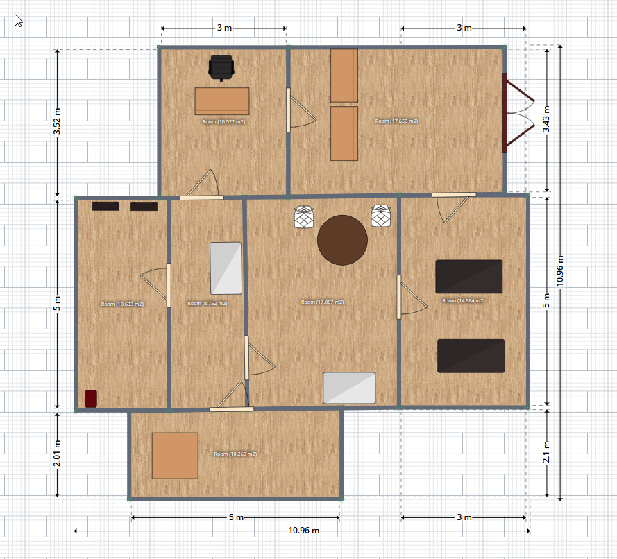

# The Escape Room

```
  ______    __                                         
 /_  __/   / /_   ___                                  
  / /     / __ \ / _ \                                 
 / /     / / / //  __/                                 
/_/     /_/ /_/ \___/                                  

    ______                                             
   / ____/   _____  _____  ____ _    ____   ___        
  / __/     / ___/ / ___/ / __ `/   / __ \ / _ \       
 / /___    (__  ) / /__  / /_/ /   / /_/ //  __/       
/_____/   /____/  \___/  \__,_/   / .___/ \___/        
                                 /_/                   
    ____                                               
   / __ \  ____   ____    ____ ___                     
  / /_/ / / __ \ / __ \  / __ `__ \                    
 / _, _/ / /_/ // /_/ / / / / / / /                    
/_/ |_|  \____/ \____/ /_/ /_/ /_/    
```

This text based game is based on two dictionaries that hold all the game story, commands, progress and items.

---

# **SPOILERS AHEAD**

--- 

## Game State

dictionary structure of game state
- current_room -> name of current room
- inventory -> list of inventory items

## Rooms

Dictionary structure of a room (space)
- Name of room
  - description -> text to show in the room
  - options --> dictionary of commands in that room
    - command -> text to show for that command
  - required_items -> dictionary of commands that require item
    - command -> required item
  - next_room -> dictionary of commands leading to a other room
    - command -> room led to
  - items -> list of items in this room

## Floorplan



## Story

Title: The Forgotten Office

Introduction: You wake up in a dimly lit room, the faint hum of fluorescent lights buzzing overhead. Your head throbs as you try to remember how you got here. On the table in front of you lies a key. You pick it up, feeling a sense of urgency to escape.

### Room 1: The Locked Room

Clue: A crumpled note on the floor reads, “Find the truth, or be lost forever.”

Item: The key to the door.

### Room 2: The Hallway

Description: A narrow hallway stretches out before you, with doors on either side. The air is thick with dust, and the walls are lined with old, faded photographs.

Clue: One photograph shows you shaking hands with a man in a lab coat, with the caption, “Project Genesis - 2023.”

### Room 3: The Storage Room

Description: Shelves filled with old equipment and boxes. A cabinet and a bookshelf stand against the wall.

Clue: A journal on the bookshelf details experiments on memory manipulation, with entries signed by “Dr. H.”

### Room 4: The Office

Description: A cluttered office with papers strewn everywhere. A computer screen flickers with an unfinished email.

Clue: The email reads, “We must keep the subject contained until we can reverse the process. The memories are too dangerous.”

### Room 5: The Front Office

Description: A reception area with a large window showing the outside world. The door to freedom is locked, but a keypad next to it requires a code.

Clue: A sticky note on the receptionist’s desk has the code “0423” written on it.

### Additional Room 1: The Break Room

Description: A small room with a coffee machine and a few chairs. A bulletin board on the wall has various notices pinned to it.

Clue: One notice reads, “Staff Meeting - Discussing the ethical implications of Project Genesis.”

### Additional Room 2: The Lab

Description: A sterile lab with various scientific instruments and vials. A whiteboard has a complex diagram of the human brain.

Clue: A document on the lab table reveals that you were part of an experiment to erase traumatic memories, but something went wrong.

---

Conclusion: As you piece together the clues, you realize that you were a test subject in an experiment gone awry. The scientists were trying to erase traumatic memories, but instead, they locked you in a loop of confusion. With the code in hand, you unlock the front door and step into the sunlight, free but forever changed by what you discovered.


