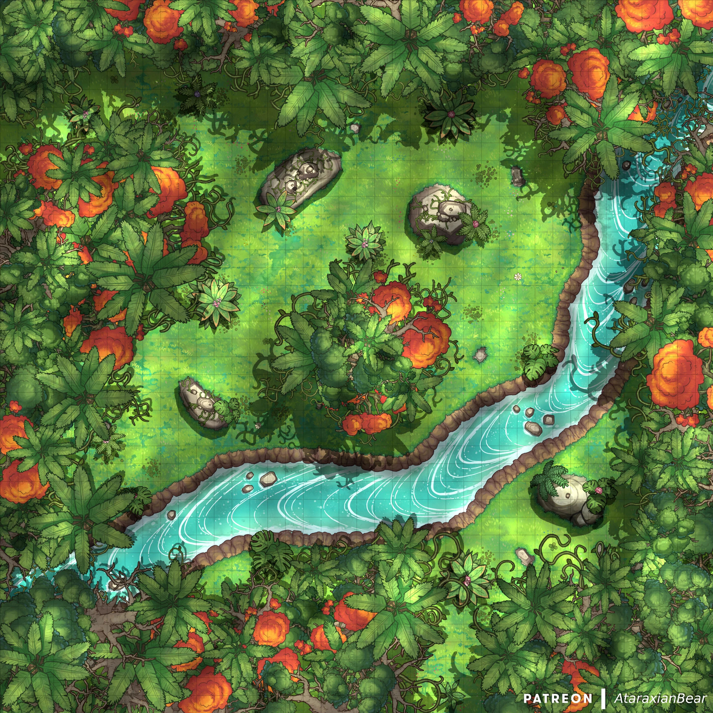

# Find My Home - An adventure game

```
        ___________.__            .___    _____          
        \_   _____/|__| ____    __| _/   /     \ ___.__. 
        |    __  |  |/    \  / __ |   /  \ /  <   |  | 
        |     \   |  |   |  \/ /_/ |  /    Y    \___  | 
        \___  /   |__|___|  /\____ |  \____|__  / ____| 
            \/            \/      \/          \/\/      
        ___ ___                                        
        /   |   \  ____   _____   ____                  
        /    ~    \/  _ \ /     \_/ __ \                 
        \    Y    (  <_> )  Y Y  \  ___/                 
        \___|_  / \____/|__|_|  /\___  >         
```

The game is designed around text based adventure genre. The story is stored within a list object.

In this game, the user finds self lost in a mystical forest and makes many choices on the way to get back home. 

---

# **SPOILERS AHEAD**

It's not going to to be an easy task to figure all options out.

--- 

### Game Objects

Game flows in one direction, with no state managed within the program.

There are few objects worth noting:
```
questions -> holds all the questions for the game
commands -> contains all the valid responses or choices user can make
```

## Floorplan



## Story

### Title: Find My Home

Introduction: You are the middle of a mystical forest, and it's going to get dark soon. You are trying to get home safely before the sunset.

### Stage 1: The Intersection

You can choose either of the path, but one leads to danger.

### Stage 2: The Old Platform

Description: You find an old platform erected on the side of the mountain. 

Clue: Upon reaching, you find few useful tools to get you home. Which one will get you home?

The platform is going to crash soon. So better hurry up!

### Stage 3: The Lake

You find yourself with a choice to cross the lake, but there is something untold about this lake. Are you brave enough to face it?

### Stage 4: Night at the Witch's home 

As deceiving it may look, the real answer lies somewhere near the witch. Will you trust her, or, run away?

### Stage 5: The Home or Game Over?

Based on your decisions from past, you will be rewarded a mystery surprise. But, choose wisely and appearances can be deceiving!

---

Conclusion: As you go along the jungle path, you will also learn the moral of the story.

If you figure out after the end, do DM me personally :)


