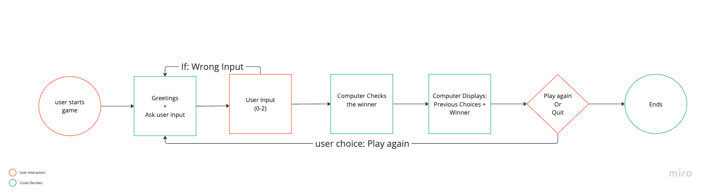

Use Case #1:
User plays rock-paper-scissor game from start to end in a loop

Steps:

1. User starts playing a rock-paper-scissor game
2. computer displays welcome message, and ask the user to choose
3. user chooses a nr from 0-2; if they choose wrong number, the loop plays again
4. computer displays both choices
5. computer chooses who won, and displays on the screen
6. computer asks if use wants to play again, and decides to quit or replay from §1

