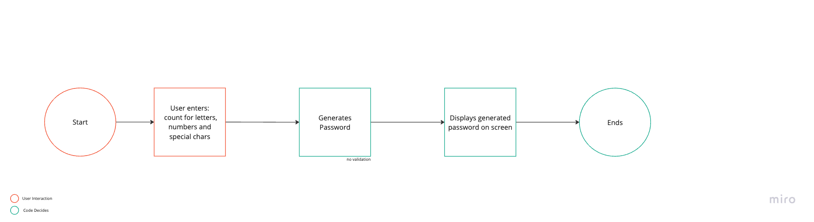

# Steps:

#### Use Case #1:
User inputs their choice to generate a strong password

`Password should abide count provided by the user, and generate a strong password containing letters (both small and capitals mixed), numbers and special characters`

1. User inputs = count of letters, numbers, and special characters to use in generating password
2. Generates Password: Selects required elements from the elements module, shuffles them, and returns generated password
3. Returns the generated password on the screen

## Flow Example
